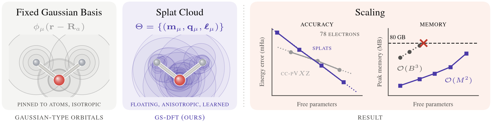

<div align="center">

# Scaling Density Functional Theory with Gaussian Splatting

**Andrés Guzmán-Cordero**<sup>1,2</sup> · **Cindy Zhang**<sup>3</sup> · **Majdi Hassan**<sup>1,2</sup> · **Marta Skreta**<sup>1,2</sup> · **Kirill Neklyudov**<sup>1,2,5,†</sup> · **Matija Medvidović**<sup>4,†</sup>

<sup>1</sup>Mila – Quebec AI Institute · <sup>2</sup>Université de Montréal · <sup>3</sup>Princeton University · <sup>4</sup>ETH Zurich · <sup>5</sup>Institut Courtois · <sup>†</sup>Equal supervision

[](https://www.python.org/)
[](https://github.com/jax-ml/jax)
[](LICENSE)



</div>

## Abstract

Density functional theory (DFT) strikes a practical balance between accuracy and computational cost in many problems of computational chemistry and materials science.
However, many DFT calculations are limited by fixed atom-centered basis sets, which dictate how accuracy and cost scale with system size.
We propose *Gaussian Splatting for Density Functional Theory* (GS-DFT), which represents molecular orbitals as a cloud of Gaussians whose positions, shapes, and mixing coefficients are optimized jointly by gradient descent to minimize the energy without training data.
Conceptually, GS-DFT is 3D Gaussian splatting with the renderer replaced by quantum mechanics.
We introduce two key solver components: adaptive density fitting with screening for efficient evaluation of two-electron integrals, and a regularized differentiable orthogonalization of the molecular orbitals.
Empirically, the optimized basis reaches the accuracy of the largest conventional basis sets with a fraction of the parameters, converging systematically in energy, density, and nuclear forces.
At equal parameter count, it captures the stretched-bond and anion physics that fixed bases only recover with specialized basis augmentation.
The resulting solver exhibits quadratic peak memory scaling in the cloud size, allowing us to simulate systems of up to 2,742 atoms (10,406 electrons) without any modifications at triple-zeta scale using a single four-GPU node.

## What is in this repository

- **`gs_dft`**, a JAX package for Kohn–Sham DFT in a basis of floating, anisotropic Gaussians. Each
  splat carries a position, an orientation (a unit quaternion) and three widths, and the cloud is
  trained together with the orbital coefficients by direct minimization of the energy.
- **The two solver components of the paper**: adaptive density fitting on an auxiliary basis built
  from products of the splats, with pair screening, and a regularized eigensolve that keeps the
  orthogonalization differentiable when orbital overlaps become degenerate.
- **Streaming and sharding** for large systems: exact Coulomb with a custom backward pass, chunked
  exchange–correlation quadrature, and data-parallel execution over the GPUs of one node.
- **Every experiment of the paper**, with its configuration, launcher and plotting script, and the
  data every figure is built from.

## Installation

The project is managed with [uv](https://docs.astral.sh/uv/) and needs Python 3.13. On Linux the GPU
build of JAX (CUDA 12) is installed; on macOS JAX runs on the CPU.

```bash
git clone https://github.com/andresguzco/gs-dft
cd gs-dft
uv sync
```

Importing `gs_dft` enables `jax_enable_x64` globally: the method runs in double precision, and
several engine constants are built at import time.

## Quickstart

Build the energy once, then train and evaluate a splat cloud:

```python
import jax.random as jr
from gs_dft import SplatKS, df, pairlist, native_grid, init_model, train, evaluate, splat_forces
from gs_dft.benchmark import build_reference
from dftax.energy.xc import PBE

mol, e_ref, nao, _ = build_reference("co2", "cc-pvdz", "pbe", 3)  # Gaussian reference: energy and n_ao
ks    = SplatKS(mol, PBE(),                                # build once
                grid=native_grid(mol, 3, chunk=4096),      #   streamed XC quadrature
                coulomb=df(), screen=pairlist(eps=1e-7))   #   adaptive density fitting + pair screening
model = init_model(mol, M=126, key=jr.PRNGKey(0))          # 126 splats (n_ao = 42 for cc-pVDZ)
res   = train(ks, model, steps=6000)                       # Adam, warmup and cosine decay
E     = evaluate(ks, res.model, res.state)                 # exact-Coulomb energy (Ha)
F     = splat_forces(ks, res.model, res.state)             # nuclear forces (Ha/Bohr)
```

Because the basis moves during training, the significant-pair list and the auxiliary basis live in a
`SplatState` that `train` rebuilds at a fixed cadence. The same flow runs from the command line:

```bash
uv run python -m gs_dft.ks.train --molecule co2 --M 126 --screened
uv run python -m gs_dft.benchmark --molecule ethanol        # splats against the Gaussian ladder
```

## Reproducing the paper

Every figure rebuilds from the data committed in [`data/`](data/), without a GPU:

```bash
make figures
```

[`REPRODUCING.md`](REPRODUCING.md) maps each figure and table to the runs that produced it, and
[`experiments/`](experiments/) holds one directory per result:

| Directory | Paper |
|---|---|
| [`exp1_ablation_ladder`](experiments/exp1_ablation_ladder/) | Figure 2; eigensolve, optimizer, refresh and screening ablations (Appendix E) |
| [`exp2_observables`](experiments/exp2_observables/) | Figure 3; ionization potentials (Table 2) |
| [`exp3_lih_dissociation`](experiments/exp3_lih_dissociation/) | Figure 4(b); dissociation ladders (Appendix F) |
| [`exp4_anion`](experiments/exp4_anion/) | Figure 4(a); anion table (Appendix F) |
| [`exp5_basis_accuracy`](experiments/exp5_basis_accuracy/) | Figure 5; functional coverage (Table 1) |
| [`exp6_cost_benchmark`](experiments/exp6_cost_benchmark/) | the GS-DFT water check of Appendix D |
| [`exp7_size_ladder`](experiments/exp7_size_ladder/) | FMO proteins (Table 3) |
| [`exp8_data_free_init`](experiments/exp8_data_free_init/) | initialization ablation (Appendix E) |
| [`exp9_frameworks`](experiments/exp9_frameworks/) | comparison with differentiable DFT codes (Appendix D) |

## Repository layout

```
gs_dft/          the package
  basis/         the splat chart, the pair-product auxiliary basis, initialization
  integrals/     overlap, kinetic, nuclear attraction and ERIs; closed-form 3×3 algebra
  coulomb/       streaming exact Coulomb; RI-J and RI-K on the auxiliary basis
  screening/     overlap pair lists and screened kernels; chunked grid density
  ks/            SplatKS, energy terms, training, forces, sharding, regularized Löwdin
  benchmark.py   the Gaussian reference and the accuracy benchmark
  geometries.py  molecule presets
conf/            Hydra configuration of the experiment runners
experiments/     one directory per result in the paper
data/            the data behind every figure and table, as CSV
tests/           the test suite
```

## Tests

```bash
make test        # the test suite, on CPU
```

The tests check the parametrization (finite gradients, rotation equivariance) and every fast path
(streaming, screening, density fitting, sharding) against the dense reference, in values and in
gradients.

GS-DFT uses [`dftax`](https://pypi.org/project/dftax/) as its base because it implements Kohn–Sham
DFT natively in JAX: it supplies the exchange–correlation functionals, the integration grids and the
Gaussian-basis references. Everything specific to splats, and every experiment in the paper, lives
in this repository.

## Citation

If you use this work, please cite the paper. [`CITATION.cff`](CITATION.cff) carries the same
metadata, and GitHub's "Cite this repository" reads it.

```bibtex
@article{guzmancordero2026gsdft,
  title   = {Scaling Density Functional Theory with Gaussian Splatting},
  author  = {Guzm\'an-Cordero, Andr\'es and Zhang, Cindy and Hassan, Majdi and Skreta, Marta and
             Neklyudov, Kirill and Medvidovi\'c, Matija},
  journal = {arXiv preprint arXiv:XXXX.XXXXX},
  eprint  = {XXXX.XXXXX},
  archivePrefix = {arXiv},
  primaryClass  = {cs.AI},
  year    = {2026},
  url     = {https://arxiv.org/abs/XXXX.XXXXX}
}
```

The FMODB structures and their published FMO energies are used under
[CC BY-SA 4.0](https://creativecommons.org/licenses/by-sa/4.0/); this repository stores only their
IDs. Please cite FMODB alongside this work: Takaya et al., *J. Chem. Inf. Model.* **2021**, 61, 777.

## License

Apache-2.0. See [LICENSE](LICENSE).
